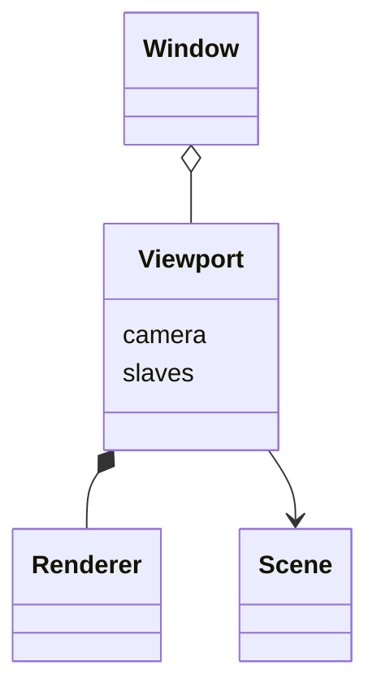

# opeViewer

重构osgViewer

> 部分代码是直接拷贝的

> 暂时不实现多线程，只保留多线程扩展性

## 主要变更

### 弃用osg::Camera::setGraphicsContext

1. osg::GraphicsContext::runOperations
    * 仅执行operations，不再调用相关相机（视口）Renderer；调用相机（视口）Renderer由Window完成
2. osg::GraphicsContext::resized
    * 仅更新Traits，不再更新相关相机（视口）Viewport和投影矩阵；更新相机（视口）Viewport和投影矩阵由Viewport完成

### 弃用run、frame、advance等函数（过程）

* 由外部（窗口）系统驱动窗口绘制
    * 由外部驱动帧前进
    * 将事件遍历从帧绘制中剥离

### 概念更新

1. 弃用osgViewer::GraphicsWindow概念，使用opeViewer::GraphicsWindow概念
2. 弃用osgViewer::ViewerBase概念，使用opeViewer::Window概念
3. 弃用osgViewer::View概念，使用opeViewer::Viewport概念

## 设计

| 类        | 名称    | 基本说明             |
|----------|-------|------------------|
| Window   | 窗口    | 包含若干视口           |
| Viewport | 视口    | 显示一个场景           |
| camera   | 视口相机  | 描述视口渲染属性，包含一个渲染器 |
| slaves   | 视口从相机 | -                |
| Scene    | 场景    | -                |
| Renderer | 渲染器   | -                |

## 计划

### 0.1

1. 移除多线程等内容
2. 明确窗口、视口的概念

替换osgQt

### 0.2

多线程？

多上下文（qt每个窗口一个上下文）切换？
> 虽然可以通过`Qt::AA_ShareOpenGLContexts`启用全局共享上下文
